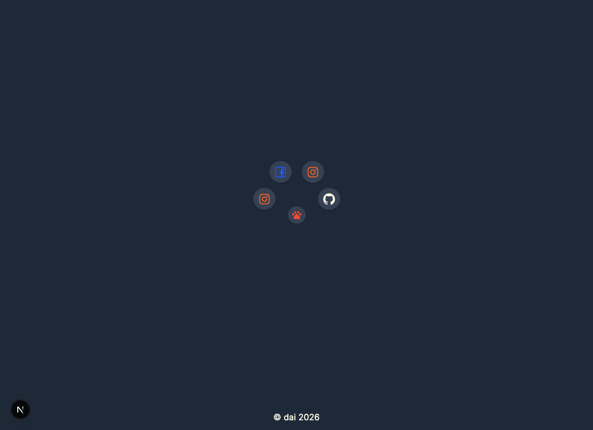
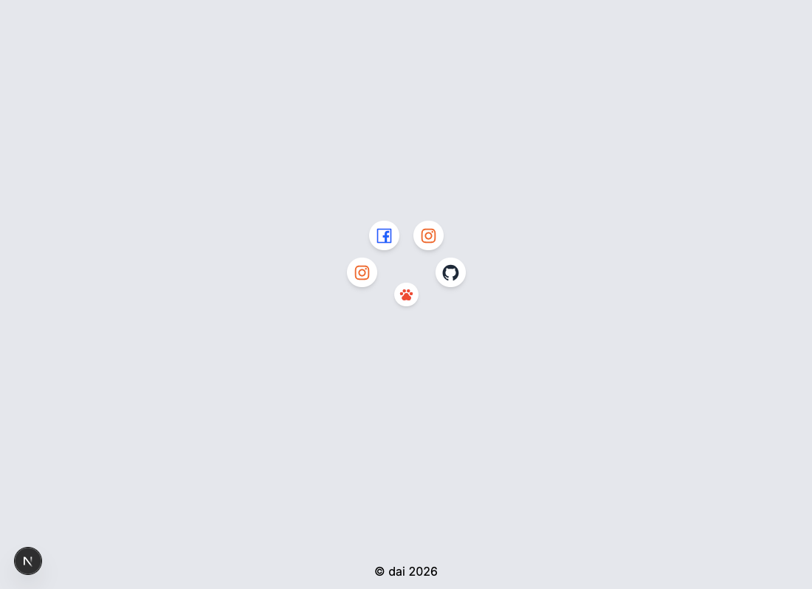

# Sos - Halaman Tautan Sosial

Ini adalah proyek halaman sederhana yang menampilkan tautan ke berbagai profil sosial media dengan gaya menu radial yang interaktif. Dibuat menggunakan Next.js dan Tailwind CSS.




## ✨ Fitur

- **Menu Radial**: Tombol utama akan menampilkan beberapa tombol tautan sosial di sekelilingnya saat diklik.
- **Responsif**: Desain yang dapat menyesuaikan diri dengan berbagai ukuran layar.
- **Tautan Sosial**: Mengarahkan pengguna ke profil GitHub, Instagram, dan Facebook.
- **Dapat Dikustomisasi**: Mudah untuk menambah atau mengubah tautan sosial dengan memodifikasi komponen `Home`.

## 🛠️ Teknologi yang Digunakan

- [Next.js](https://nextjs.org/) - Framework React
- [React](https://reactjs.org/) - Pustaka antarmuka pengguna
- [Tailwind CSS](https://tailwindcss.com/) - Framework CSS
- [TypeScript](https://www.typescriptlang.org/) - Superset JavaScript
- [React Icons](https://react-icons.github.io/react-icons/) - Pustaka ikon SVG

## 🚀 Memulai

Untuk menjalankan proyek ini secara lokal, ikuti langkah-langkah berikut:

1.  **Clone repositori ini:**

    ```bash
    git clone https://github.com/dai-rewahandi/sos.git
    ```

2.  **Masuk ke direktori proyek:**

    ```bash
    cd sos
    ```

3.  **Install dependensi:**
    (Proyek ini menggunakan `bun`, tetapi Anda juga bisa menggunakan `npm` atau `yarn`)

    ```bash
    bun install
    ```

4.  **Jalankan server pengembangan:**

    ```bash
    bun dev
    ```

5.  Buka browser Anda dan kunjungi `http://localhost:3000` untuk melihat hasilnya.

---

Dibuat dengan ❤️ oleh [Daire Wahandi](https://github.com/dai-rewahandi)


Terimakasih untuk gemini-ai untuk deskripsi ini karena saya sangat malas untuk membuatnya
